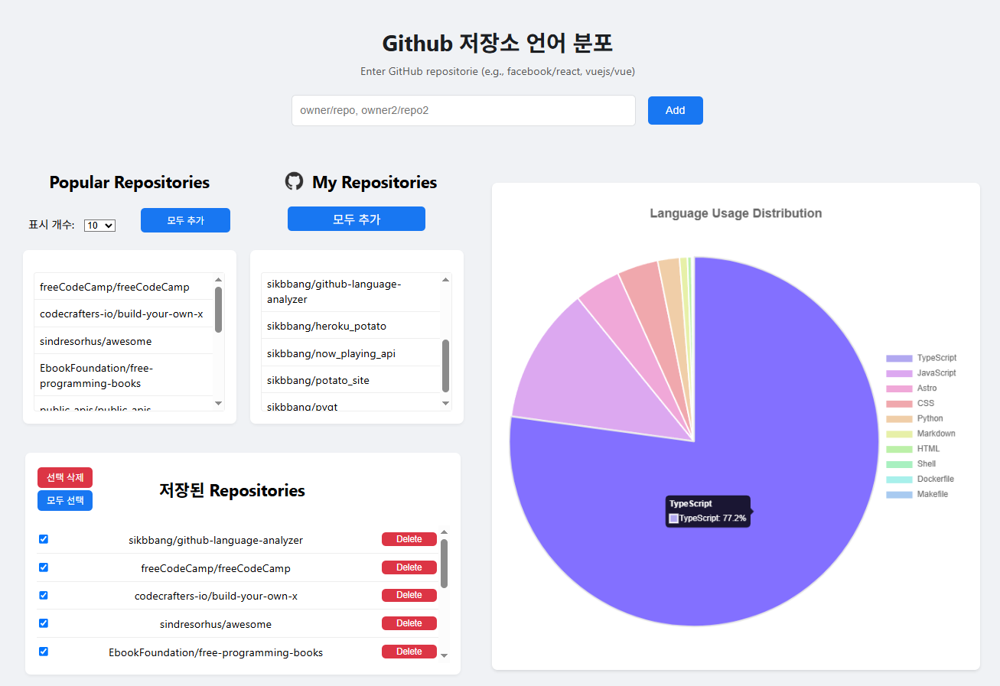

# GitHub Language Analyzer

## 1. 프로젝트 제목 및 설명
- 프로젝트 명 : GitHub Language Analyzer
- 이 프로젝트는 여러 GitHub 저장소의 언어 사용량을 분석하고 비교하기 위해 설계된 웹 애플리케이션입니다. 사용자는 저장소 이름을 입력하고, 인기 있는 저장소를 확인하며, 선택한 저장소의 언어 분포를 그래프를 통해 시각적으로 볼 수 있습니다.

## 2. 주요 기능 소개
*   GitHub Api를 이용한 여러 GitHub 저장소의 언어 사용량 비교.
*   Chart.js를 사용한 언어 분포 시각화.
*   인기 있는 GitHub 저장소 탐색.
*   인증된 사용자의 개인 저장소 보기.
*   빠른 접근을 위해 선택한 DataBase및 LocalStorage 캐싱.
*   CRUD기능 Create(Repo 추가), Read(Repo 조회), Update(Repo 변경), Delete(Repo 삭제)
*   width: 1300px, 950px 마다 바뀌는 반응형 웹 디자인

## 3. 설치 및 실행 방법

### 전제 조건

Node.js 및 npm이 설치되어 있는지 확인하세요.


1.  프로젝트 디렉토리로 이동합니다:
    ```bash
    cd src
    ```
2.  의존성을 설치합니다:
    ```bash
    npm install
    ```

### 환경 변수 설정

1.  `github-language-analyzer` 디렉토리에 `.env` 파일을 생성합니다.
2.  `.env` 파일에 GitHub 개인 액세스 토큰과 GitHub 사용자 이름을 추가합니다:
    ```
    GITHUB_TOKEN=your_personal_access_token
    GITHUB_USERNAME=your_github_username
    ```
    *   **참고**: GitHub 개인 액세스 토큰은 비공개 저장소를 가져오려면 `repo` 범위가, 사용자 저장소를 가져오려면 `user` 범위가 필요합니다.

### 서버 실행

Express.js 서버를 시작합니다:

```bash
npm start
```
서버는 `http://localhost:3000`에서 시작됩니다.


## 4. 기술 스택

*   **프런트엔드**: Vanilla JavaScript, HTML, CSS (데이터 시각화를 위한 Chart.js 포함)
*   **백엔드**: Node.js (Express.js 사용)
*   **데이터 소스**: GitHub REST API (v3)
*   **데이터베이스**: SQLite (인기 저장소 캐싱용)
*   **LocalStorage**: Repositorie 저장용

## 5. 스크린샷 또는 데모 영상(선택)


## 6. 개발 과정에서의 AI활용 방법
1. 백엔드 및 API 통합 (server.js, githubFetcher.js)
    - GitHub API 연동 코드 생성
        - githubFetcher.js 파일의 getRepoLanguages 함수 초안 획득
    - 페이지네이션 로직 작성
        - githubFetcher.js의 getUserRepos 함수에 필요한 수동 페이지네이션 로직을 생성
    - Express 라우트 및 오류 처리
        - server.js 파일의 /api/compare 엔드포인트와 초기 오류 처리(res.status(400).json(...)) 로직을 자동 생성하여 보일러플레이트 감소

2. 데이터 분석 및 로직 (languageAnalyzer.js)
    - 언어 사용률 계산 로직
        - languageAnalyzer.js의 analyzeLanguages 함수처럼, 집계, 백분율 계산, 정렬을 포함하는 핵심 로직을 정확하게 생성
    - SQLite 데이터베이스 초기화
        - server.js 하단의 데이터베이스 초기화 및 시딩(Seeding) 로직을 빠르게 구성

3. 프론트엔드 및 디버깅 (index.html)
    - Chart.js 시각화 코드 생성
        - index.html의 renderChart 함수에 필요한 데이터 변환 및 Chart.js 옵션 설정 코드 획득
    - 오류 및 버그 디버깅
        - 이벤트 핸들러 중복 실행을 막는 isSaving 플래그 또는 exitEditMode를 활용하는 로직을 제안받아 코드를 수정
    - CSS 스타일링 및 반응형 디자인
        - index.html의 style 태그에 있는 반응형 CSS (@media (max-width: 1300px))를 보강